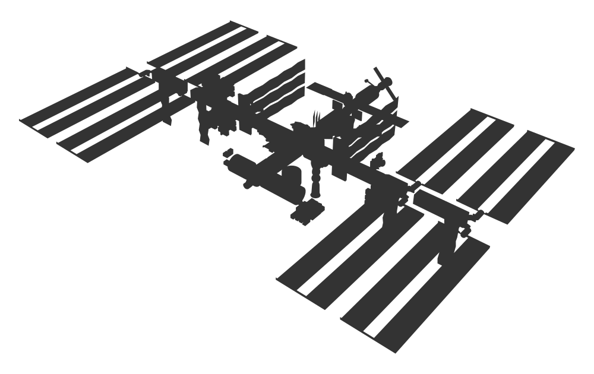

# iss_tracker 

<h3>
Consuming data from wheretheiss.at API.
</h3>

## About ISS Tracker

ISS Tracker main goal is to pin point, on a map, the International Space Station real time location.

The app uses the "Where The ISS at?" [API](https://wheretheiss.at/w/developer) to gather the ISS data.

It then implements the [Leaflet](https://leafletjs.com/) library to display the data on a map.

## Live demo

## Getting started

To get a local copy up and running follow these simple steps.

### Prerequisites

A browser. 

### Installation

Clone the repository

Run index.html

## License

   
